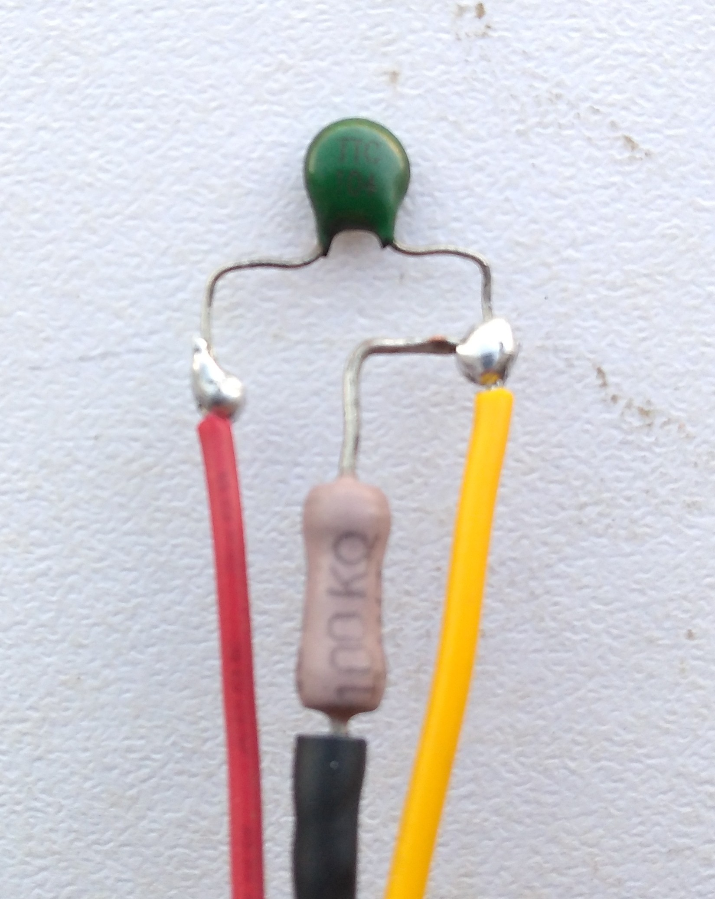
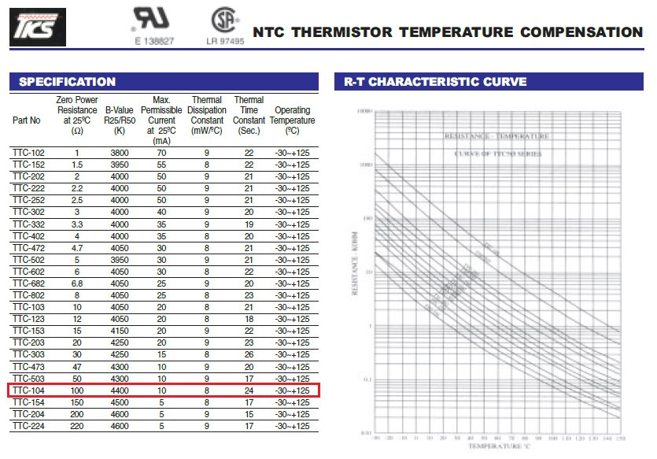

---

# INTEGRAÇÃO DA API COM OS DADOS DO ARDUINO FORNECIDOS PELO TERMISTOR

Código Desenvolvido por `Lucas Muffato`.


### MATERIAIS

* 1 Placa de Arduino;
* 1 Cabo de conexão UBS (normalmente incluso no Arduino);
* 1 Termistor;
* 1 Resistor de 100k ou 10k ohms;
* 1 Display LCD 16x2 ( OPCIONAL ).

### O QUE SE ESPERA FAZER?

Se tudo der certo, a informação da temperatura ambiente vai percorrer todo o caminho abaixo até chegar no CSS:
```
Temperatura ambiente -> Thermistor -> Divisor de Tensão -> Arduino -> Porta Serial do PC -> API Node Express -> React -> CSS
```
### CONSIDERAÇÕES INICIAIS

Esse códio é para os termistores `NTC`, ou seja, os resistores que diminuem a
resistência elétrica com o aumento da temperatura. Sabendo disso, para se
descobrir a temperatura, basta obter o valor da resistênica elétrica do
termistor no instante da medição.

Lembrando que a variação resistênica/temperatura não é uma taxa linerar, e
sim logarítima. Por isso é necessário utilizar a função que descreve o
comportamento do termistor, além de seus coeficientes específicos, que serão
abordados mais adiante.

O termistor usado foi um Termistor NTC, `Modelo TTC 104` da marca TSK.

⚠️ `ATENÇÃO`: O código funciona perfeitamente com outros termistores NTC, desde que seja consultado os coeficientes específicos do termistor na documentação do componente (datasheet) fornecida pelo fabricante ou vendedor.

A documentação é facilmente encontrada na internet.

Em caso de dúvida, a especificação do modelo do termistor vem escrito no componente.



#### O `fio vermelho` está conectado a saída de `5 volts`;
#### O `fio preto` está conectado a saída `GND`;
#### O `fio amarelo` está conectado a `porta analógica A0`.

A medida que for prosseguindo no texto abaixo, isso fará mais sentido e irá facilitar o entendimento.

---

# Como fazer isso funcionar?

## 1 - Converter o sinal recebido na porta analógica do arduino em tensão (volts):

As portas analógicas do arduino, indicam valores de 0 a 1023.
O valor 0 corresponde a 0 volts e o valor 1023 corresponde a 5 volts.

Como a varição de 0 a 1023 é linera, podemos concluir que:
  ```
Vi/Vf = 1023/Pa
  ```
Onde:
  ```
Vi = Tensão inicial 5 volts;
Vf = Tensão final aplicada na porta anlógica;
Pa = Valor recebido na porta analógica;
  ```
Logo, o valor de Vf pode ser obtido por:
  ```
Vf = ( Vi * Pa)/1023
  ```
## 2 - Determinar a Resistênicia do Termistor:

Primeiro é necessário estabelecer o tipo de ligação eletrônica que será usada.

Para proteger o termistor, ele será ligado em série com um resistor de 100k Ohm,
formando um divisor de tensão, conforme o esquema elétrico abaixo:
  ```
  |------T------|
  |             |
  |      |--R---|
  |      |      |
  5v    GND    A0
  ```
Onde:
  ```
5v = Vi = Saída de alimentaçaõ de 5 volts do arduino;
A0 = Pa = Porta analógica número 0; 
T: Termistor (sensor de temperatura);
R: Resistor de 100k Ohm;
GND: Referência de tensão 0;
  ```
⚠️ `ATENÇÃO`: Como a Resistência Nominal do Thermistor é de 100k ohm, recomenda-se
utilizar um resistor de 100k ohm para formar o divisor de tensão. O termo Resistência Nominal
será explicado mais abaixo.

O interesse nesse passo, é descobrir o valor da resistênica do termistor, e para isso será
usado o valor Vf, encontrado na fórula do Passo 1, e a Lei de Ohm.

A Lei de Ohm afirma o seguinte:
  ```
V = I * R

V = Tensão em volts
I = Corrente elétrica em amperes;
R = Resistência elétrica em Ohms;
  ```
Com isso:
  ```
Rt = Resistência do Termistor;
Rr = Resistênica do Resistor de 100 k ohm;
  ```
Equação 1 - Utilizando o valor da tensão inicial:
  ```
Vi = I * (Rt + Rr)
  ```
logo:
  ```
  I = Vi/(Rt + Rr)
  ```
Equação 2 - Utilizando o valor da tensão final:
  ```
Vf = I * Rr
  ```
logo:
  ```
  I = Vf / Rr
  ```
Unindo as duas equações através da corrente (I):
  ```
Vf/Rr = Vi/(Rt + Rr)
  ```
Logo:
  ```
Rt = (Vi * Rr)/Fv - Rr
  ```
## 3 - Determinado a temperatura do termistor pela Equação do Fator Beta (β)

  ```
1/T = 1/Tn + 1/β * ln(Rt/Rn)
  ```
Onde:
  ```
T = Temperatura medida no termistor, em kelvins;
Tn = Temperatura nominal, que é a temperatura em que o termistor foi calibrado;
β = Coeficiente Beta, é o cofeficinete relacionado a variação de Resistênica/Temperatura;
ln = Logarítimo Natural, ou Log(e), onde a base do logarítimo é a constante de Euler.
Rt = Resistência atual do resistor, em Ohms;
Rn = A resistênica do termistor na temperatura de calibragem;
  ```
Simplificando a equação em função da temperatura (T), temos:
  ```
T = ( β * Tn )/( β + Tn * ln( Rt/Rn ));
  ```
# FLUXO DO CÁLCULO

## 1º Receber o sinal da Porta A0 e converter em Tensão (Vf).
  ```
Vf = ( Vi * Pa)/1023
  ```
## 2º. Aplicar o valor de Vf na fórmula abaixo e obter a resistência do termistor (Rt):
  ```
Rt = (Vi * Rr)/Fv - Rr
  ```
## 3º Aplicar o valor de Rt na fórmula abaixo, e consultar os coeficientes na documentação do termistor:
  ```
T = ( β * Tn )/( β + Tn * ln( Rt/Rn ));
  ```
A documentação do Termistor está no link:
https://datasheetspdf.com/pdf-file/768616/TKS/TTC-104/1


  ```
Tn = 25 graus Celsius (°C);
Rn = 100k Ohms;
β = 4400;
  ```
⚠️ `IMPORTANTE`:
* Como o valor de `Tn` foi informado na documentação em `graus Celsius`, é necessário converte-lo na `escala kelvin`, somando 273.15.
* Como a equação resulta na `temperatura` na `escala kelvin`, para converte-la em `graus Celsius`, basta subtrair 273.15.

Logo a equação final fica:
  ```
T = ( β * Tn + 273.15 )/( β + (Tn + 273.15 ) * ln( Rt/Rn )) - 273.15;
  ```

# ESQUEMA DE PINOS DO DISPLAY

⚠️ Não é necessário utilizar o display de LCD para fazer a API funcionar.

No projeto, foi utilizado um display de LCD 16x2 para verificar a temperatura sem a
necessidade de ligar o arduino no computador.

Os dados podem ser exportados e lidos no monitor serial, disponível no próprio software do Arduino (IDE), ou diretamente pelo terminual do linux pelo comando:
```
cat /dev/ttyACM0
```

Caso tenha interesse em utilizar o display, aqui está o esquema dos pinos
ligados no Arduino.

  ```
DYSPLAY |  VSS | VVD | V0 | RS | RW | E | D0 | D1 | D2 | D3 | D4 | D5 | D6 | D7 | A | K |
ARDUINO |  GND | 5v  | Pt | D7 | GND| D6|    |    |    |    | D5 | D4 | D3 | D2 | 5v|GND|           
  ```

### ⚠️ Essa siglas estão escritas sobre os pinos, tanto na placa do arduino quanto na placa do display.

O pino Pt do Display é ligado em um potenciômetro, para controlar o contraste da tela.
A ligação do potenciômetro é feita conforme o esquema abaixo:

  ```
  |--Potenciômetro--|
  |        |        |
  |        |        |
  |        |        |
  5v       Pt      GND
  ```
O potenciômetro utilizado foi de `10K ohms`.

## ⚠️ `ATENÇÃO:` Nunca faça conexão entre terminais do arduino sem um resistor!
Isso pode provocar a queima da placa ou da porta (digital ou analógica) em que a ligação for feita. Um exemplo disso seria, conectar o terminal 5v em alguma porta analógica ou digital, ou mesmo no terminal GND.

# PROGRAMANDO O ARDUINO

Primeiro, deve-se instalar o software do Arduino (IDE), e conectar o arduino no computador pelo cabo USB.

Se as ligações entre os componentes foram feitas conforme descrito acima, pode-se copiar o código abaixo, colar na IDE do software do Arduino e carregar na placa.

```
#include <LiquidCrystal.h> // Carrega A biblioteca do Display de LCD

// Determinar quais pinos digitais da placa do Arduino serão usados
LiquidCrystal lcd(7, 6, 5, 4, 3, 2);

// Carrega as configurações que serão executadas apenas uma vez
void setup() {
  //Abre a porta serial e define a taxa de dados para 9600 bites por segundo.
  Serial.begin(9600);
    
  // Ativa o display, usando as 16 colunas e as 2 linhas
  lcd.begin(16, 2);

  // Limpa a tela do LCD de quaisquer dados anteriores.
  lcd.clear();
}

// Inicia o código que será repetido em loop.
void loop() {

// CÁLCULO DA RESISTÊNCIA DO TERMISTOR
// Cria as variáveis

float T;                    // (T)  = Temperatura atual no termissor graus celsius.
float Tk;                   // (T)  = Temperatura atual no termissor kelvin.
float Vf;                   // (Vf) = Tensão de Saída.
float Vi = 5;               // (Vi) = Valor da Tensão Inicial ou Tensão de Entrada.
float Rt;                   // (RT) = Resistência atual do Termistor.
float Rr = 100000;          // (R0) = Resistor de 100K Ohms.

// O valor da variável "Va" será o mesmo valor lido na porta analógica A0.
Va = analogRead(A0);

// AJUSTE DA PRECISÃO

/* Devido as pequenas variaçoẽs da corrente, o valor de entrada acaba variando em uma faixa.
Por isso, faz-se a média aritimética de 5 amostras a acada 200 milisegundos. */

float soma = 0;             // Soma das Amostras.
int n = 5;                  // Número de amostras.
float Pa = 0;               // Valor da porta analógica A0.
float amostra[n];           // Amostra.

// Cria 5 amostras contendo o valor da porta analógica a cada 200 milissegundos.
for (n=0; n< 5; n++) {
  amostra[n] = analogRead(A0);
  delay(200);
}

// Soma as amostras
for (n=0; n< 5; n++) {
  soma += amostra[n];
}

// Média aritimética das amostras
Pa = (soma/5);

// FLUXO DO CALCULO:
// 1. Convertendo o valor da porta analógica em tensão:
Vf = ((Pa * Vi) / 1023);

// 2. Determinando a Resistência do Termissor pela diferença de Tensão:
Rt = ((Rr * (Vi - Vf)) / Vf);

// 3. Determinado a temperatura:
float B  = 4400;            // (B)  = Fator Beta.
float T0 = 25;              // (T0) = Temperatura Nominal em graus celsius.
float R0 = 100000;          // (R0) = Resistência Nominal em K Ohm.

Tk = 1/( (1 / (T0 + 273.15) ) + (( log(Rt / R0) )/B) );

/* OBS.: No arduíno a função log(x) define a função do logarítimo natural (ln).
Para utilizar outra base, como a base 10, é necessário especificar. */

// A temperatura encontrada é convertida de kelvins para graus celsius.
T = (Tk - 273.15);

// EXIBIR A TEMPERATURA NO DE LCD

// Move o Cursor do LDC para Coluna 0 e a linha 0.
lcd.setCursor(0, 0);

// Exibe o texto entre aspas na tela.
lcd.print("Temperatura:");

// Move o Cursor do LDC para Coluna 0 na linha 1.
lcd.setCursor(0, 1);

// Exibe o valor da variável T.
lcd.print(T);

// Exibe um espaço em branco logo depois do dado anterior.
lcd.print(" ");

// Exibe um "C" logo depois do dado anterior.
lcd.print("C");

// EXIBE O VALOR DA TEMPERATURA NA PORTA SERIAL
Serial.print(T);Serial.print("\n");

// Espera 1000 milissegundos (1 segundo) para iniciar o loop novamente.
delay(1000);
}
// A partir o conchetes o código se inicia novamente.
```

Se tudo deu certo, o arduino já está medindo a temperatura correta e transmitindo para a porta `serial 9600`, através da conexão com a porta `USB`.

# CONSTRUINDO A API

## BASE DA API

### 1 - Criar o diretório:
```
mkdir arduino-api;
cd arduino-api;
```
### 2 - Instalar o npm:
```
npm init -y
```
### 3 - Instalar o express:
```
npm i express
```
### 4 - Criar o arquivo que recebe e o código da API:
```
touch apiArduino.js
```

### 5. Copie e cole o código do exemplo abaixo para testar:
```
const express = require('express');
const app = express();

app.get('/arduino', handleHelloWorldRequest);

app.listen(3001, () => {
  console.log('Aplicação ouvindo na porta 3001');
});

function handleHelloWorldRequest(req, res) {
  res.status(200).send('Hello arduino!');
}
```

### 6 - Executar a API:
```
node apiArduino.js
```

### 7 - Acessar a API pelo navegador, e ver se as informações chegaram corretamente, conforme a url abaixo:
```
http://localhost:3001/arduino. 
```
### 8 - Para encerrar a transmissão da API, basta aperta as teclas abaixo no terminal:
```
Ctrl + C
```

## PERMITINDO O ACESSO AOS DADOS DA API

⚠️ `Observação`: Para uma aplicação back-end receber requisições de uma aplicação front-end, ou qualquer outra aplicação, é preciso instalar o módulo `cors` que libera o acesso da nossa API para outras aplicações.

### 1 - Instalar o pacote cors
```
npm i cors
```

### 2 - Adicionar as seguintes linhas no início do arquivo apiArduino.js:
```
const express = require('express');
const app = express();
const cors = require('cors');

app.use(cors());
```
### 3 - O conteúdo do arquivo apiArduino.js deve ficar assim:
```
const express = require('express');
const app = express();
const cors = require('cors');
app.use(cors());

app.get('/arduino', handleHelloArduinoRequest);

app.listen(3001, () => {
  console.log('Aplicação ouvindo na porta 3001');
});

function handleHelloArduinoRequest(req, res) {
  res.status(200).send('Hello arduino!');
}
```

## IMPORTANDO OS DADOS DO ARDUINO

Para que o nodeJs acesse os dados transmitidos pela porta serial, é necessário instalar o pacote Node SerialPort.

### 1 - Instalar o pacote Node SerialPort:
```
npm install serialport
```
### 2 - Acessando os dados da porta serial:

Copie e cole o conteúdo abaixo dentro do arquivo apiArduino.js.
```
const express = require('express');
const app = express();
const cors = require('cors');
app.use(cors());

// IMPORTANDO DADOS DO ARDUINO
const SerialPort = require('serialport');
const Readline = require('@serialport/parser-readline');
const port = new SerialPort('/dev/ttyACM0', { baudRate: 9600 });
const parser = port.pipe(new Readline());

//Delimitador entre linhas
// const parser = port.pipe(new Readline({ delimiter: "-" }));

let valueSerial = "";

// Recebendo os dados da porta serial
port.on("open", () => { console.log('Porta Serial Aberta') });
parser.on('data', data => { valueSerial = data });

// Convertendo os dados no formato JSON
app.get('/arduino', function (req, res, next) {
  // res.json({apiData: valueSerial });
  res.json({ dados: valueSerial });
  console.log(valueSerial);
})

app.listen(3001, () => {
  console.log('Aplicação ouvindo na porta 3001');
  // console.log(valueSerial); // Apenas para exibir no terminal
});
```
No caso do arduino trasmitir mais de um dado por vez, é possível especificar um caractere que seja o delimitador entre os dados, para que o nodeJs seja capaz de usar os dados separadamente. Na linha comentada acima, o caractere delimitador é o "-".

Esse caractere deve ser especificado no código feito na IDE do Arduino.

## ⚠️ `ATENÇÃO`: Não faça o upload de novos códigos na placa do Arduino se a API estiver trasmitido dados. Isso pode travar a placa. Para caregar novos dados, feche a API primeiro, apertando `Ctrl + C` no terminal.

# CONSUMINDO OS DADOS NO REACT

## Criando uma aplicação React

### 1 - Instalar o pacote react:
O react irá criar a pasta onde os pacotes serão instalados.
```
npm create-react-app arduino-react;
```
### 2 - Testar o a aplicação:
Depois de terminar, entre na pasta e faça o comando `npm start` no terminal. Se tudo corre bem, deve aparecer a página com o logo do react.
```
cd arduino-react;
npm start
```

### 3 - Recebendo os dados da API:
No código abaixo, os dados estão sendo importados por uma função assincrona, e atualizados no useEffect a cada um segundo, para não sobrecarregar a aplicação com dezenas de chamadas por segundo.
```
import React, { useState, useEffect } from 'react';

export default function TemperatureFetch() {
  const [temp, setTemp] = useState("");

  // Recebe os dados da API do Arduino
  const fetchArduino = async () => {
    try {
      const response = await fetch('http://localhost:3001/arduino')
      const data = await response.json();
      setTemp(data);
      // console.log(data);  // Apenas para verificação
    } catch (error) { console.error(error) }
    // console.log(temp); // Apenas para verificação
  };
  
  useEffect(() => {
  setInterval(() => {
      fetchArduino();
  }, 1000);
  }, []);

  return (
    <div>
     <h1>React Componente Temp</h1>
     <h1>{`Temperatura: ${temp.dados}°C`}</h1>
     </div>
  );
}
```
### 4 - Alterando a cor do CSS de acordo com a temperatura:
O modelo de cores `hsl(0, 100%, 50%)` permite a mudança da cor pela alteração do primeiro dígito do padrão. Essa alterão segue um modelo linear, indo de 0 (vermelho) a 345 (rosa). Porém, como a temperatura cresce a medida que fica mais quente, não faz muito sentido a cor inicial ser a vermelha e a cor final ser tons roxo.

Para que o esquema de cores vá das cores mais frias para as mais quentes de acordo com o aumento da temperatura, é necessário inverter a escala.

### 4.1 - Determinar o intervalo de temperatura:
Considerando o meu contexto de uso, não se espera que a temperatura fique abaixo de 15 graus e maior que 80 (ação de fogo), logo o intervalo de temperatura é de 65 graus. Cada contexto de uso define o seu intervalo.

⚠️ Atenção: Respeitar os limites de temperatura de uso, indicadas no datasheet.

### 4.2 - Determinar o intervalo de cores:
A cor mais quente começa com o 0 (vermelho) e vai até 255 (azul), com isso o intervalo de cores é de 255 unidades.
```
logo:  255/65 = 3.92.
```
Ou seja, a cada 1 grau de temperatura, a cor irá variar em 3.92 unidades.

### 4.3 - Invertendo a escala:

O valor do primeiro dígito deve ser:
```
PrimeiroDigito =  255 - (temperatura * 3.92)
```

### 4.4 - Com isso o código final deve ficar parecido com isso:
```
import React, { useState, useEffect } from 'react';

export default function TemperatureFetch() {
  const [temp, setTemp] = useState("");

  // Recebe os dados da API do Arduino
  const fetchArduino = async () => {
    try {
      const response = await fetch('http://localhost:3001/arduino')
      const data = await response.json();
      setTemp(data);
      // console.log(data);  // Apenas para verificação
    } catch (error) { console.error(error) }
    // console.log(temp); // Apenas para verificação
  };
  
  const temperature = temp.dados * 1;

  const changeBackGroundColor = () => {
    // colorH 0 (red) a 240 (azul)
    let colorH = (240 - (temperature * 3.5).toFixed(0));
    // console.log(colorH); // Apenas para verificação
    document.body.style.backgroundColor = `hsl(${colorH}, 100%, 50%)`;
  };
  
  useEffect(() => {
  setInterval(() => {
      fetchArduino();
  }, 1000);
  }, []);

  useEffect(() => {
      changeBackGroundColor();
    }, [temp]);

  return (
    <div>
     <h1>React Componente Temp</h1>
     <h1>{`Temperatura: ${temp.dados}°C`}</h1>
     </div>
  );
}
```

# CONSIDERAÇÕES FINAIS

## Isso só se aplica a temperatura? Esse conhecimento é útil?

A maioria dos sensores analógicos disponíveis no mercado, podem ser controlados e intepretados usando os conceitos utilizados aqui, como o divisor de tensão.

No caso, se o termistor foi substituido por um sensor de luz, ao invés de utilizar a Equação do Fator Beta, será outra equação, no caso uma equação linear, e novamente, com os coeficientes fornecidos pelo fabricante.

Sensor de luminosidade, sensor de umidade, sensor de cores, sensor de som, giroscópio, sensor de movimento... São diversas maneiras que o computador pode se comunicar e extrair informações do mundo real.

E por que não expandir mais, e salvar esse dados em um mongodb ou SQL?

## `Pense nas possibilidades!`


